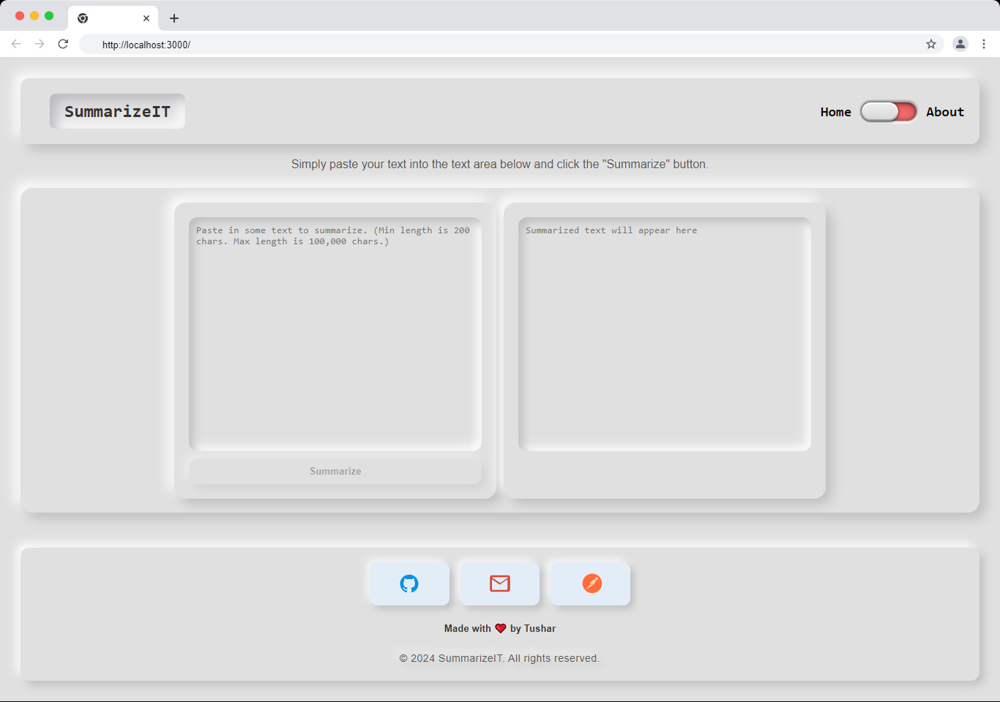
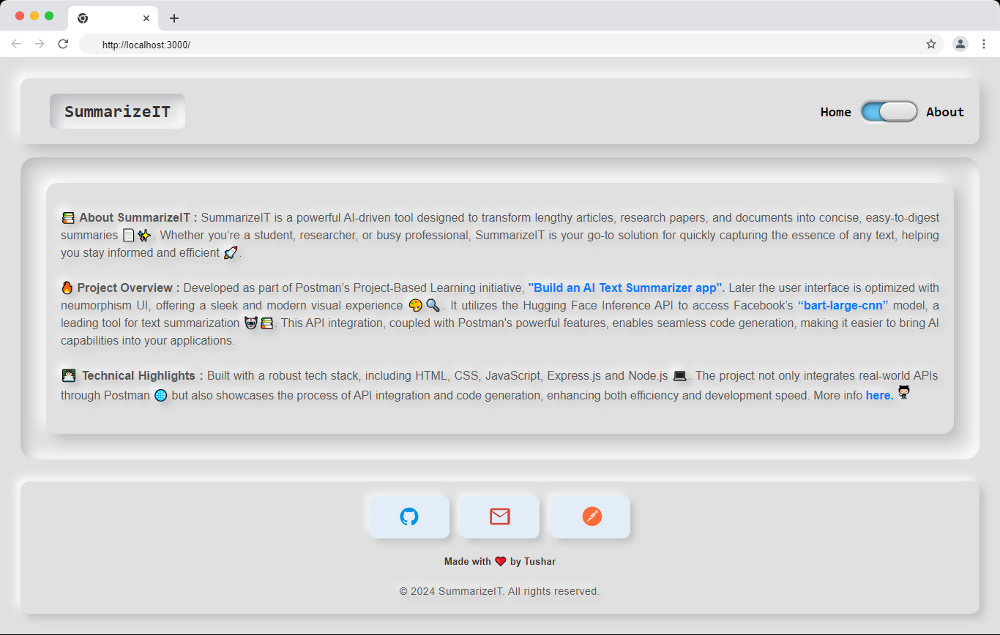

# 🌟 SummarizeIT

<div style="text-align: justify;">

Welcome to **SummarizeIT**! ✨ This advanced AI-powered tool is designed to convert lengthy articles, research papers, and documents into concise, easy-to-read summaries. 📚 Whether you're a student, researcher, or professional, SummarizeIT offers a streamlined approach to extracting the core ideas from extensive texts, allowing you to stay informed and efficient. 🚀

## **Project Overview**

- Developed as part of Postman’s Project-Based Learning initiative, [**"Build an AI Text Summarizer app"**](https://academy.postman.com/project-ai-text-summarizer).
- Designed with a modern user interface featuring neumorphism-inspired design principles. 🎨
- Leverages the Hugging Face Inference API to integrate Facebook’s [**“bart-large-cnn”**](https://huggingface.co/facebook/bart-large-cnn) model for text summarization. 🧠
- Demonstrates the integration of real-world APIs through Postman.

</div>


## 🚀 Installation

1. **Clone the repository:**

   ```bash
   git clone https://github.com/570RM/summarizeit.git
   cd summarizeit
   ```

2. **Install dependencies:**

   Ensure you have [Node.js](https://nodejs.org/en/learn/getting-started/how-to-install-nodejs) and [npm](https://docs.npmjs.com/cli/v10/commands/npm-install) installed. 

   Then, install the required packages:


   ```bash
   npm install
   ```

3. **Set up the `.env` file:**

   Create or edit the `.env` file in the root directory and add the following environment variable:

   ```bash
   ACCESS_TOKEN=your_token_here
   ```

   Replace `your_token_here` with your actual Hugging Face API key.

## 🔐 Obtaining the Access Token for Hugging Face API

1. **Create a Hugging Face account:**

   If you don't have a Hugging Face account, [sign up here](https://huggingface.co/join) and log in.

2. **Get your API token:**

   - Go to your [Hugging Face settings](https://huggingface.co/settings/tokens).
   - Click on "Access token" and then on **+ Create new token**.
   - Keep it **Read Only**, enter the required scopes, and copy the generated token.

3. **Add the token to your `.env` file:**

   ```bash
   ACCESS_TOKEN=your_token_here
   ```

## 🏃‍♂️ Running the Project

Once everything is set up, you can run the project with:

```bash
node index.js
```
or alternatively run:

```bash
nodemon index.js
```

This will start the server, and you can access the application through your web browser at `http://localhost:3000`.

## 🛠️ Technology Stack

- **Frontend:** HTML, CSS, JavaScript
- **Backend:** Express.js, Node.js
- **API Integration:** Hugging Face Inference API
- **UI Design:** Neumorphism

## 🌐 Project Features

- **AI-Powered Summarization:** Leverages the power of Facebook's **“bart-large-cnn” model** to provide accurate and concise summaries.
- **Modern UI:** A sleek neumorphism-based design for an enhanced user experience.
- **API Integration:** Seamlessly integrates with the Hugging Face API for real-time summarization.

## 📸 Screenshots

Here are some screenshots of the SummarizeIT project in action:





## 📝 Feedback

If you have any feedback, suggestions, or run into any issues, feel free to open an issue on [GitHub](https://github.com/570RM/summarizeit/issues) or reach out to me directly.

Thank you for checking out SummarizeIT! 🤩
